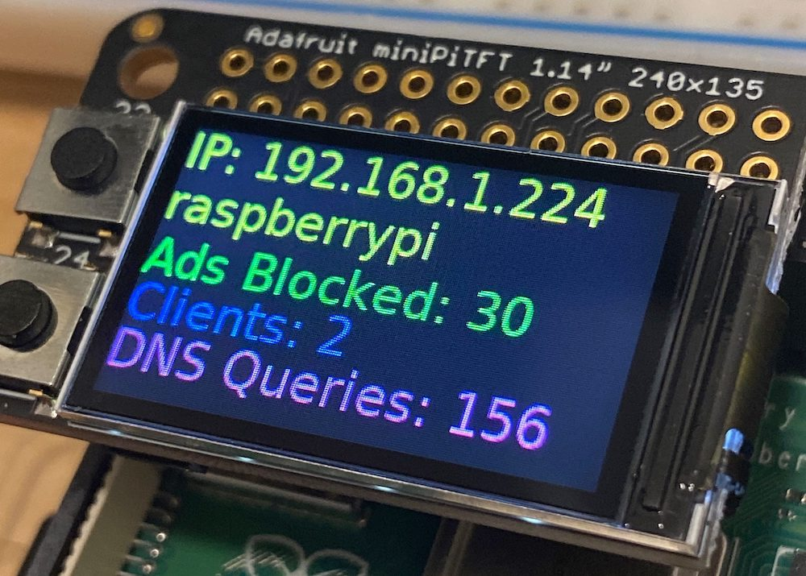

# AdaFruit miniPiTFT

AdaFruit make several small displays for Raspberry Pi, including some tiny TFT displays. I bought a Raspberry Pi Zero to use as a [Pi Hole](https://pi-hole.net/) to block adverts on my home network and also bought an [Adafruit Mini PiTFT - 135x240 Color TFT Add-on for Raspberry Pi](https://www.adafruit.com/product/4393), mostly because it looked cool! It has the added benefit of allowing me to check the Pi is up and running if I have any network issues when checking the physical networking around my router. 

I have no intention of displaying the console output to this device, so opted to install the python drivers for this display instead of the kernel drivers which cannot both be installed at the same time. The display can be controlled using CircuitPython. 

Getting the display running was straight-forward if a little manual following the [AdaFruit guide](https://learn.adafruit.com/pi-hole-ad-blocker-with-pi-zero-w/install-mini-pitft).

I want to make something a bit more advanced, so I went down an interesting yet unfortunate rabbit hole learning about displayio, Groups, TileGrids etc only to find out that there is [no support for displayio on Raspberry Pi](https://forums.adafruit.com/viewtopic.php?f=60&t=164892&p=809707). Instead this display needs to use the [AdaFruit CircuitPython RGB Display](https://github.com/adafruit/Adafruit_CircuitPython_RGB_Display) python library and [Pillow](https://pillow.readthedocs.io/en/stable/index.html). The AdaFruit GitHub repo has some useful examples, as does [learn.adafruit.com](https://learn.adafruit.com/adafruit-mini-pitft-135x240-color-tft-add-on-for-raspberry-pi/python-usage).
