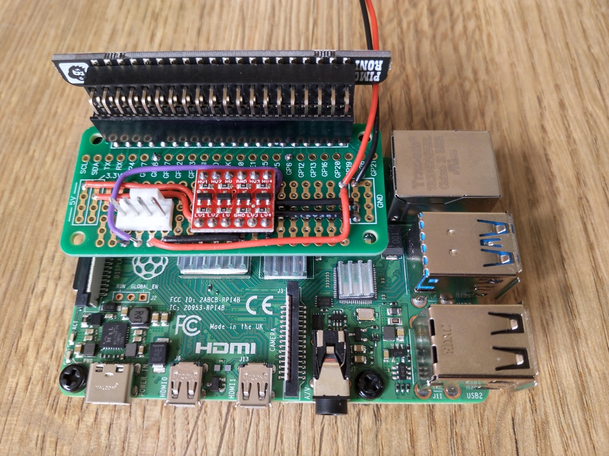

# Part 2 - Smart cooling



### Parts

* [Noctua NF-A12x25 12v PWM fan](https://noctua.at/en/products/fan/nf-a12x25-pwm)
* [SparkFun Logic Level converter](https://shop.pimoroni.com/products/sparkfun-logic-level-converter-bi-directional)
* [ABElectronics Breakout PiZero prototyping PCB](https://thepihut.com/products/breakout-pizero)
* [Molex 47053-1000 4 pin pcb mount socket](https://uk.farnell.com/molex/47053-1000/connector-header-4pos-1row-2-54mm/dp/2313705)
* 5.5/2.5mm DC socket
* 12v power supply (from stock)
* 24awg single core wire

### Pins used

* GPIO/BCM 18 - for PWM control to fan, via logic level convert to boost 3.3v GPIO to 5v
* GPIO/BCM 6 - for RPM speed monitor, via logic level converter. Input signal in Hz, two pulses per revolution. 

### Design

The SparkFun logic level converter [board overview](https://learn.sparkfun.com/tutorials/bi-directional-logic-level-converter-hookup-guide/all#board-overview) shows that each side of the MOSFET has a 10K ohm pull-up resistor. I'm hoping the RPM speed signal can be read using this from a 5v supply using the high voltage side of the logic level converter. 

### Electrical Circuit Design 

The Raspberry Pi has GPIO pins which can provide a Pulse Width Modulation (PWM) signal. [Pinout.xyz](https://pinout.xyz/) is a useful resource for working out the pinout and purposes of the GPIO pins which you can use, as well as seeing which pins various HATs, pHATs and SHIMs use when stacking boards together.


Pinout.xyz was useful in confirming which pins the Blinkt! LED array would use which I'll be stacking on top of this PWM fan control board. As we can see from https://pinout.xyz/pinout/blinkt only pins BCM 23 and BCM 24 need to be reserved for the Blinkt! so BCM 18 (PWM0) can be used to generate the PWM signal for the fan and BCM 6 for monitoring the fan speed (BCM 6 was a coin-toss selection, based on it's physical proximity to where the signal wire (at one point) was coming onto the board. 

The GPIO pins use 3.3v for I/O, and the Noctua fan needs a 5v PWM signal. Fortunately SparkFun make a cheap (£3) logic level converter which can translate a signal from a low voltage to a high voltage and vice versa. We can use the Raspberry Pi 5v GPIO to power the high voltage side of the board, as the PWM signal draws very little current. 


As the LLC board has pull-up resistors on each side then a second channel can be used for reading the signal from the Noctua fan speed wire, which the [Notcua fan PWM specifications](https://noctua.at/pub/media/wysiwyg/Noctua_PWM_specifications_white_paper.pdf) show as needing a pull-up resistor. 

Curcuit design to be added...

### Physical Circuit Layout

The Breakout PiZero board was too small for this circuit to wire it nicely. With the logic level converter board being 5 pins wide there was little option but to cross signal and power wires over each other. The wiring under the board is not accessible which I could have used pins and sockets to connect the logic level converter board in a removable way. It does work so it is good enough for purpose, but I'm not proud of the wiring layout which is really not optimal. I chose to use it because it doesn't totally cover the Raspberry Pi 4B it is connected to, which will have CPU load which I don't want throttled due to high CPU temperature. 

### Testing

The system daemon code to control the fan will use the python GPIO libraries (assuming they prove suitable). For initial testing from the command line I'm using (the awesome) WiringPi library. 

Reading Gordon's [deprecation notice](http://wiringpi.com/wiringpi-deprecated/) for WiringPi it makes me sad that open source contributors receive such poor treatment by a number of consumers for the contributions they have made. I'm sure it is a minority of people, but equally sure that fact does not detract from the impact of their behaviour. 

For reference, here are a few quick commands to get testing with. 

```shell
# Get help for the gpio command
man gpio

# Check the version of gpio, needs v2.52 for Raspberry Pi 4B support
gpio -v

# See the pinout for your raspberry pi
gpio readall

# Set the mode for pin 1 to pwm, rather than tristate logic levels
gpio mode 1 pwm

# Use gpio pwm <pin> <level>
# Level 0 is off, eg 0% duty cycle, level 1023 is 'on', eg 100% duty cycle
gpio pwm 1 512
```

### Troubleshooting

My initial circuit would control the fan speed down to it's lowest threshold, but wouldn't turn the fan off completely as it should with a zero duty-cycle (eg. ground) PWM signal to the fan. After sleeping on the problem I realised that I'd not connected the ground from the Pi/Logic level converter to the ground from teh 12v supply which was powering the fan, leaving the PWM "ground" signal floating above the maximum voltage of 0.8v for the PWM low logic level. A bit of rewiring later and things are working as expected. This ground issue was probably also the cause of erroneous RPM readings, which I noticed at the same time as troubleshooting the fan speed. 

### Future enhancements

Pins and a detachable connector for the 12v supply leads would be useful, as would some insulation between the underside of the board and the conductive aluminium heatsinks on the Raspberry CPU, which could cause a short if not careful to stabalise the board when connecting or removing the 4 pin fan connector. Hopefully adding standoffs to fix the board in place will help, especially as I will enlarge the mounting holes to M3 size. 

### Resources

* [SparkFun logic level converter](https://learn.sparkfun.com/tutorials/bi-directional-logic-level-converter-hookup-guide/all)
* [Notcua fan PWM specifications](https://noctua.at/pub/media/wysiwyg/Noctua_PWM_specifications_white_paper.pdf)
* https://blog.driftking.tw/en/2019/11/Using-Raspberry-Pi-to-Control-a-PWM-Fan-and-Monitor-its-Speed/
